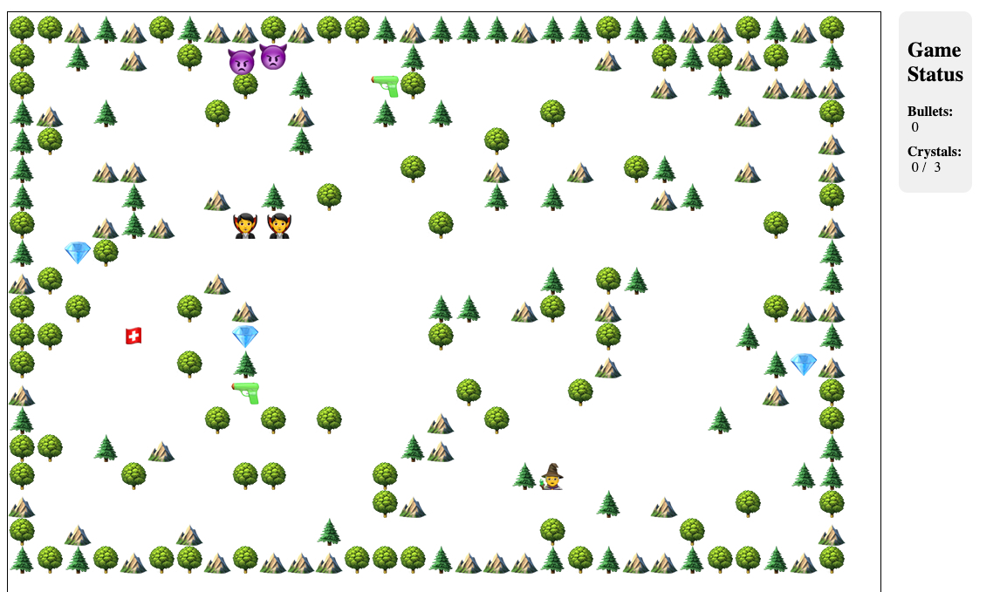

# The Leg End of Zoolda

The Leg End of Zoolda is a Roguelike adventure game with a focus on exploration and puzzle-solving.

## Demo

[Play the game here on GitHub Pages](https://dolan.github.io/zoolda-js/index.html)

## Gameplay

The game is played on a grid of tiles. The player can move around the grid, and the player can also collect crystals. The player can also shoot bullets at enemies.

The object is to collect all the crystals in the level, and then exit through the exit portal (which will not be open until all the crystals are collected). Watch out for traps and enemies! Take every opportunity to defend yourself along the way!

## The big idea

The game was intended to be randomly generated levels, with the ability to impose certain kinds of 
constructs on the level generation process. 

This part will evolve in tandem with the game play.

## The tech

The game is a normal javascript canvas app that uses a pathfinding algorithm to ensure that each level, 
though randomly generated, is solvable. The player is represented by a "wizzard" character that can move 
around the grid. The player can also collect crystals that are scattered about the level. The player has 
a certain amount of health, and the player can also shoot bullets at enemies.

